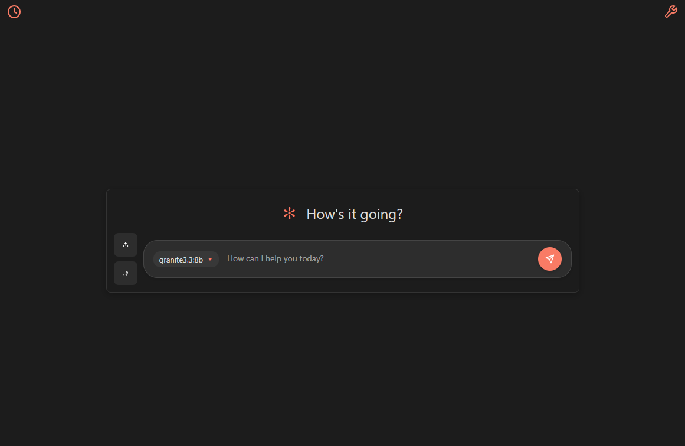
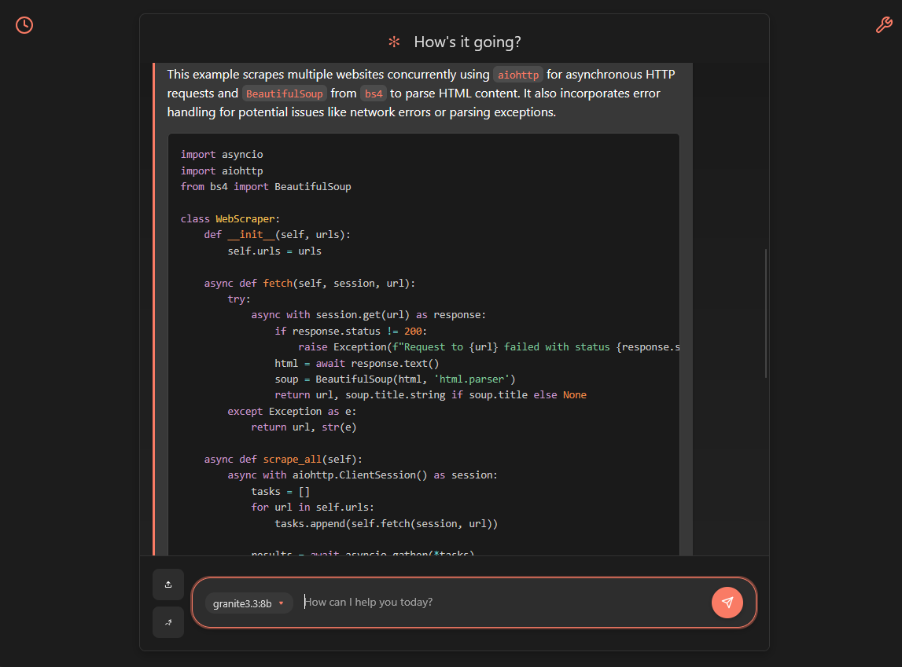
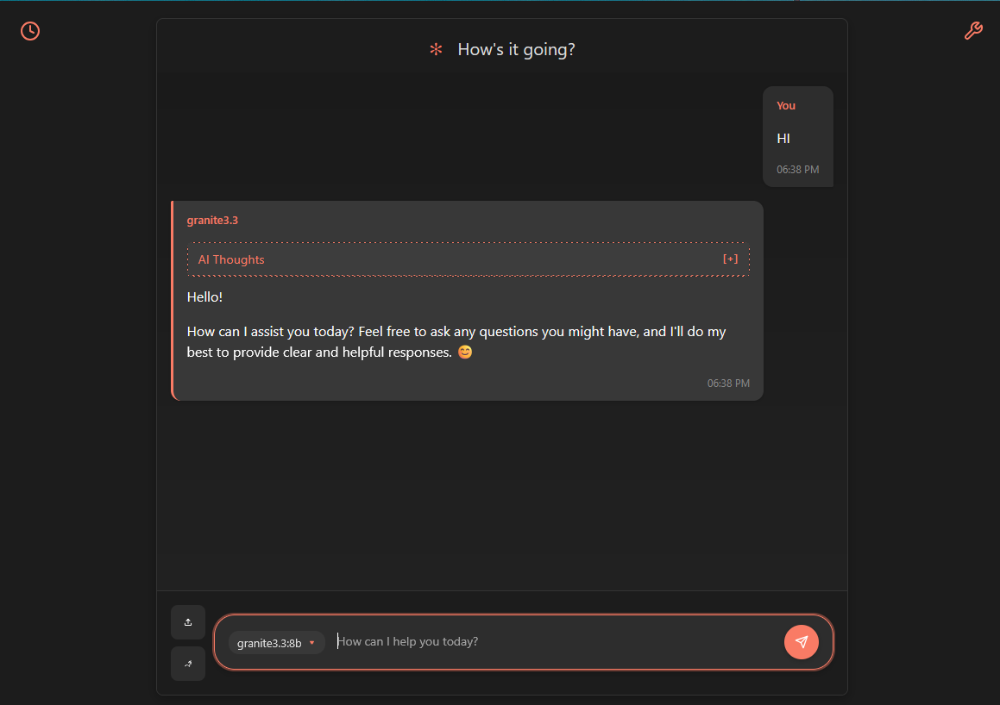

# Ollama Chat - Claude Style

A modern, single-page web chat interface for local LLMs (Large Language Models) running on [Ollama](https://ollama.com/), inspired by the visual style and UX of Anthropic's Claude. This project provides a beautiful, feature-rich frontend for chatting with your local models, supporting Markdown, code highlighting, math rendering, system prompts, file uploads, and chat history.

---

## Features

- **Claude-inspired UI:** Dark, elegant, and minimal interface closely resembling Claude's web chat.
- **Model selection:** Easily switch between available Ollama models.
- **System prompt panel:** Set and edit a custom system prompt at any time.
- **Markdown & code formatting:** Supports Markdown, tables, blockquotes, and syntax-highlighted code blocks (via Prism.js).
- **Math rendering:** Inline and block math with MathJax.
- **Collapsible "AI Thoughts":** Special `<think>...</think>` blocks render as collapsible sections for model reasoning.
- **File upload:** Add text/code files as context for the model.
- **Chat history:** Save, view, and reload previous conversations (stored in browser localStorage).
- **Responsive:** Works well on desktop and mobile browsers.

---

## Getting Started

### 1. Requirements

- [Ollama](https://ollama.com/) running locally (default: `http://localhost:11434`)
- Python (for serving the HTML file locally)
- A modern web browser

### 2. Running the Web UI

1. **Clone or download this repository.**
2. **Open a terminal in the project folder.**
3. **Start a simple HTTP server:**

   ```sh
   python -m http.server 3000
   ```

   > If you use Python 2, use `python -m SimpleHTTPServer 3000` instead.

4. **Open your browser and go to:**

   ```
   http://localhost:3000/OllamaChatb.html
   ```

   You should see the Claude-inspired chat interface.

---

## Screenshots

### Claude-inspired Visual Style

The interface is designed to closely resemble the look and feel of Claude's chat web app, with a dark background, coral accent colors, and clean, modern typography.



### Attractive Code Formatting

Code blocks are rendered with beautiful syntax highlighting and clear formatting, making it easy to read and copy code examples.


_Example: Attractive formatting of code snippets and technical answers._

### System Prompt & History Panels

Easily set a custom system prompt or browse your chat history using slide-out panels.



---

## How It Works

- **Model selection:** The app queries Ollama for available models and lets you choose which one to use.
- **System prompt:** Set a custom system prompt to guide the model's behavior.
- **Chat:** Messages are sent to Ollama's `/api/chat` endpoint, with streaming responses for fast feedback.
- **File upload:** Upload text/code files to provide additional context to the model.
- **Markdown & code:** Messages support Markdown, syntax-highlighted code, and math formulas.
- **AI Thoughts:** Use `<think>...</think>` in model outputs to create collapsible reasoning sections.
- **History:** Conversations are saved in your browser and can be reloaded at any time.

---

## Credits

- [Ollama](https://ollama.com/) for local LLM serving.
- [Prism.js](https://prismjs.com/) for code highlighting.
- [MathJax](https://www.mathjax.org/) for math rendering.
- [Marked.js](https://marked.js.org/) for Markdown parsing.
- Visual inspiration: [Claude by Anthropic](https://claude.ai/).

---

## License

MIT License

---
